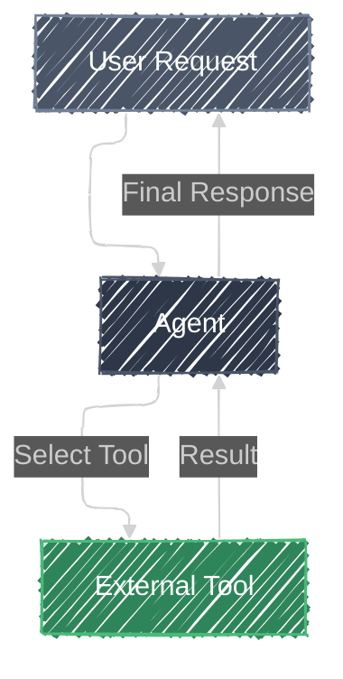

# Tool Use

> **"Give a person a fish and you feed them for a day. Teach a person to use a tool and they can calculate pi to 100 digits."**
> *Extend agent capabilities with external tools.*

## Overview

The **Tool Use** pattern enables an agent to interact with external systems, APIs, or functions to perform tasks that are beyond its inherent capabilities. This allows the agent to access real-time data, perform calculations, or execute actions in the real world.

## Architecture



## Components

| Component | Description |
|-----------|-------------|
| **Agent** | The core LLM that decides which tool to use and how to use it. |
| **Tool** | A function or API that performs a specific task (e.g., calculator, search). |

## How it Works

The agent analyzes the user's request and determines if any available tools can help fulfill it. If a tool is needed, the agent generates the appropriate input for the tool. The tool executes and returns the result to the agent. The agent then incorporates this result into its final response to the user.

## When to Use

Use this pattern when your agent needs to:

- Perform mathematical calculations.
- Access real-time information (e.g., weather, stock prices).
- Interact with external databases or APIs.
- Execute specific actions (e.g., sending emails, creating files).

## Try the Code

1. **Prerequisites**: Follow the [setup instructions](../../README.md#setup) in the root of the project.
2. **Run the Agent**:
    Run the following command in the root of the project:

    ```bash
    adk web patterns
    ```

3. **Select Pattern**: Click on **Tool Use** in the sidebar to start the demo.

## Resources

- [Agent Development Kit (ADK) Documentation: Tools](https://google.github.io/adk-docs/tools/)
- [Gemini API: Function Calling](https://ai.google.dev/gemini-api/docs/function-calling)
