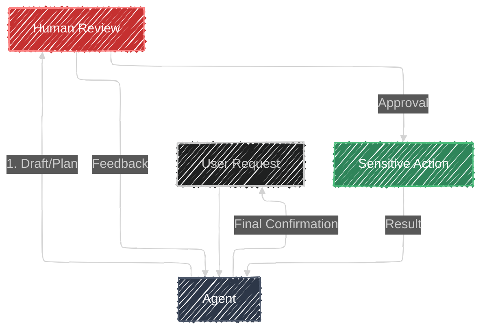

# Human-in-the-Loop

> **"Trust, but verify."**
> *Interject human judgment into automated workflows before critical actions.*

## Overview

The **Human-in-the-Loop (HITL)** pattern integrates human interaction into the agent's execution flow. While agents are powerful, they can hallucinate or make poor judgment calls. For sensitive actions—like sending emails, deploying code, or transferring funds—it is critical to pause execution and require explicit human approval.

## Architecture

## Components

| Component | Description |
|-----------|-------------|
| **Agent** | Generates the work product but is restricted from executing the final action immediately. |
| **Human** | The user acting as the "Gatekeeper" or "Editor". They provide feedback or approval. |
| **Sensitive Tool** | The function (e.g., `publish_press_release`) that effectively ends the loop. |

## How it Works

The user initiates a task, prompting the agent to generate a draft or plan. When the user requests to execute a sensitive action, the agent attempts to call the designated tool. However, the ADK framework intercepts this call because `require_confirmation` is configured. The agent then pauses to request confirmation, prompting the UI to display approval controls. If the user approves, a confirmation payload (`{"confirmed": true}`) is sent, allowing the tool to execute; if rejected, the action is blocked.

## When to Use

This pattern is essential for high-stakes actions such as publishing content, financial transactions, or resource deletion where error is unacceptable. It is also valuable for compliance purposes to ensure a human audit trail, for creative collaboration where the user guides the output, and for training scenarios where human feedback can be used to evaluate agent performance.

## Try the Demo

1. Fill out the form fields for a new product (e.g., "Coffee Toothpaste").
2. Click **Draft Press Release**.
3. The agent generates a draft.
4. Buttons ("Approve" / "Reject") appear below the draft.
5. Click **Approve**.
6. The system pauses and asks for final confirmation (simulating a "safety check").
7. Confirm the action to publish.

## Resources

- [2-Minute ADK: Human-in-the-Loop Made Easy](https://medium.com/google-cloud/2-minute-adk-human-in-the-loop-made-easy-da9e74d9845a)
