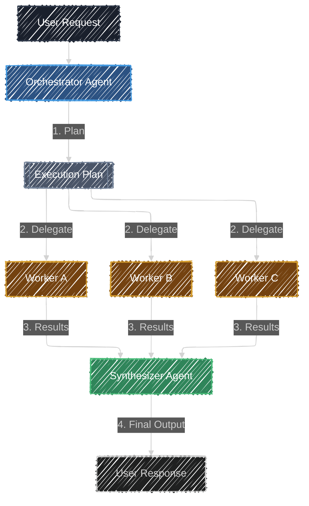

# Orchestrator

> **"A Great Conductor doesn't play every instrument; they ensure every instrument plays its part."**
> *Decompose complex problems into specialized sub-tasks and manage the execution.*

## Overview

The **Orchestrator** (or Manager-Workers) pattern is a sophisticated multi-agent strategy for handling complex, multi-faceted tasks. Unlike fixed pipelines, the Orchestrator dynamically plans the execution at runtime. It breaks down a high-level goal into several specialized sub-tasks, delegates those to "Worker" agents (often in parallel), and finally synthesizes their individual contributions into a single, cohesive response.

This pattern is ideal for tasks that require multiple types of expertise (e.g., "Research, Write, and Code") or when the problem is too large for a single context window to handle reliably in one pass.

## Architecture

## Components

| Component | Description |
|-----------|-------------|
| **Orchestrator (Planner)** | A high-level agent that analyzes the request and generates an `ExecutionPlan`. It uses structured output to define exactly what needs to be done. |
| **Worker Agents** | Specialized agents (or a generic agent with specific instructions) that perform the individual sub-tasks defined in the plan. |
| **Synthesizer (Aggregator)** | The final agent that takes the original request and the collection of worker outputs to produce the final result. |

## When to Use

- **High Complexity**: When a single LLM call is likely to "forget" details or lose focus.
- **Parallelizable Tasks**: When parts of the problem can be solved independently to save time (though in this demo we focus on the logic).
- **Specialization**: When different parts of the request require drastically different personas or specialized tools.
- **Reliability**: Breaking a task down into structured steps (Execution Plan) makes the overall system more predictable and easier to debug.

## Try the Demo

1. **Submit a complex request**: Try *"Write a marketing plan for a new VR headset, including a target audience analysis, a 3-month timeline, and a slogan."*
2. **Watch the Planning**: The Orchestrator will instantly generate a roadmap.
3. **Monitor the Workers**: See specialized agents (e.g., Market Analyst, Copywriter) work on their respective parts.
4. **Final Synthesis**: The Synthesizer pulls it all together into a professional document.
