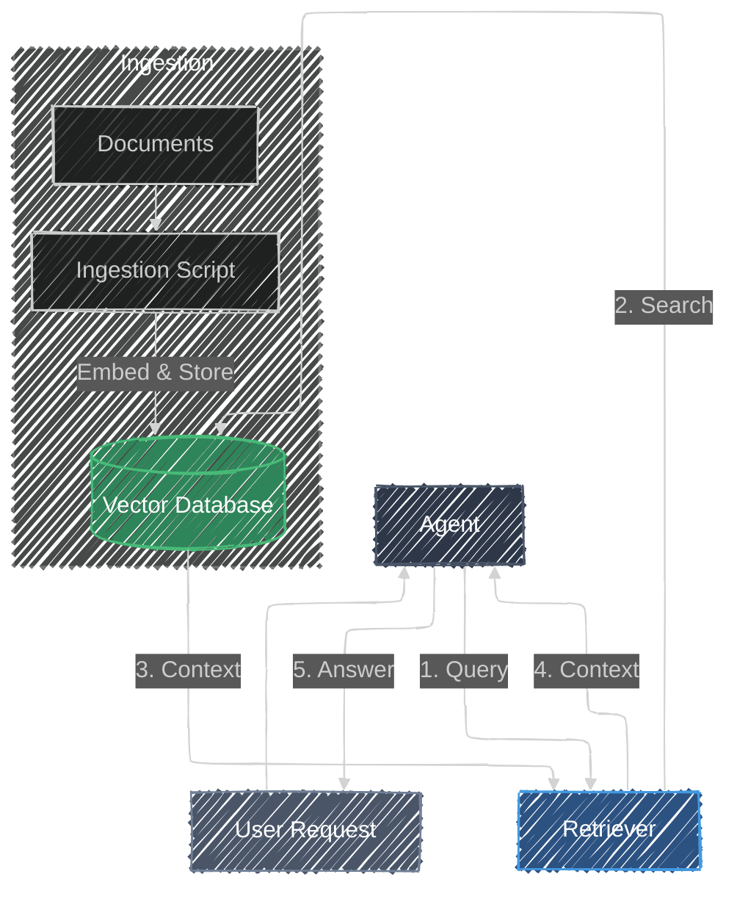

# Retrieval Augmented Generation (RAG)

> **"I don't know everything, but I know where to find it."**
> *Ground generation in external knowledge to improve accuracy and reduce hallucinations.*

## Overview

**Retrieval Augmented Generation (RAG)** is a pattern that combines the reasoning capabilities of Large Language Models (LLMs) with the factual accuracy of external knowledge bases. Instead of relying solely on its training data, the agent retrieves relevant information from a trusted source (like a database or document store) to answer questions. This ensures responses are up-to-date, accurate, and grounded in specific data.

## Architecture



## Components

| Component | Description |
|-----------|-------------|
| **Agent** | The LLM that orchestrates the process, deciding when to retrieve information and how to use it. |
| **Ingestion** | A process that loads raw text, converts it into vector embeddings using the Gemini API, and stores it. |
| **Vector Database** | A specialized database (using `sqlite-vec`) that stores embeddings and performs similarity searches. |
| **Retriever** | A tool used by the agent to query the database and fetch relevant document chunks. |

## How it Works

1. **Ingestion**: Before the agent can answer questions, knowledge must be ingested. The `ingest.py` script reads data (e.g., from a CSV), generates embeddings for each chunk using a model like `gemini-embedding-001`, and saves them to a local SQLite database.
2. **Retrieval**: When the user asks a question, the agent calls the `retrieve_knowledge` tool. This tool embeds the user's query and searches the vector database for the most similar content.
3. **Generation**: The retrieved text chunks are returned to the agent. The agent then uses this context to generate a natural language response that directly answers the user's question based on the provided facts.

## When to Use

Use this pattern when your application needs to access private data, providing answers about proprietary documents not in the model's training set. It is also essential for providing up-to-date information by referencing data that changes frequently without retraining the model. RAG helps reduce hallucinations by constraining the model to answer based only on the provided context, and it allows the model to cite sources, attributing its answers to specific documents.

## Try the Code

1. **Prerequisites**: Follow the [setup instructions](../../README.md#setup) in the root of the project.
2. **Run the Agent**:
    Run the following command in the root of the project:

    ```bash
    adk web patterns
    ```

3. **Select Pattern**: Click on **RAG** in the sidebar to start the demo.
4. **Experiment**:
    - Ask a question *before* ingesting knowledge (e.g., "What is the secret code?").
    - Click the **Ingest Knowledge** button in the UI.
    - Ask the same question again to see the agent use the retrieved information.

## Resources

- [Google Cloud: Retrieval Augmented Generation (RAG)](https://cloud.google.com/use-cases/retrieval-augmented-generation)
- [Gemini API: Embeddings Guide](https://ai.google.dev/gemini-api/docs/embeddings)
- [sqlite-vec Documentation](https://github.com/asg017/sqlite-vec)
