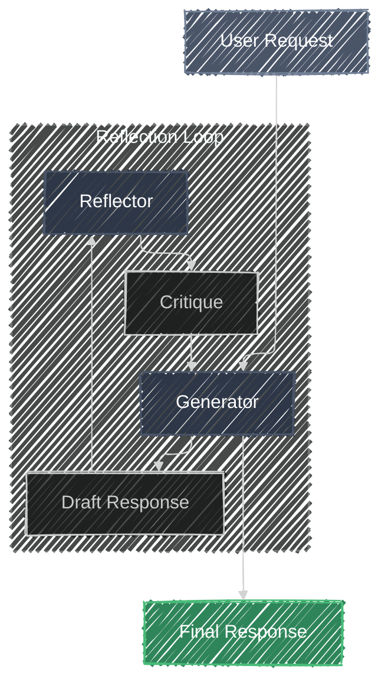

# Reflection

> **"Critique is the secret to excellence."**
> *Iteratively improve response through self-correction.*

## Overview

The **Reflection** pattern enables an agent to critique its own outputs and refine them before delivering a final result. This approach mimics human self-editing, where a first draft is reviewed and improved to ensure accuracy, clarity, and adherence to constraints.

## Architecture

## Components

| Component | Description |
|-----------|-------------|
| **Generator** | Produces the initial output based on the user's prompt. |
| **Critic** | Evaluates the output against specific criteria or general quality standards. |
| **Refiner** | Uses the critique to improve the output. |

### How it Works

The agent creates an initial response, then reviews its own work to identify errors or areas for improvement. Based on this critique, it generates a new version. This process repeats until a quality threshold is met or a maximum number of iterations is reached.

### When to Use

Use this pattern for complex tasks requiring high accuracy or adherence to strict constraints, such as code generation or creative writing. It is ideal when the cost of an error outweighs the cost of extra compute time, or when catching hallucinations and logical fallacies is critical.

## Try the Demo

1. **Enter a Prompt**: Type *"Write a short story about a lonely robot on Mars."*
2. **Watch the Loop**:
    - **Initial Draft**: The agent writes a first version.
    - **Critique**: The Critic agent reviews it for improvements.
    - **Refine**: The Refiner agent updates the story based on feedback.
3. **Completion**: The loop continues until the Critic finds "No major issues."

## Resources

- [Google Cloud Architecture: Iterative Refinement Pattern](https://docs.cloud.google.com/architecture/choose-design-pattern-agentic-ai-system#iterative-refinement-pattern)
- [ADK Documentation: Loop Agents](https://google.github.io/adk-docs/agents/workflow-agents/loop-agents/)
