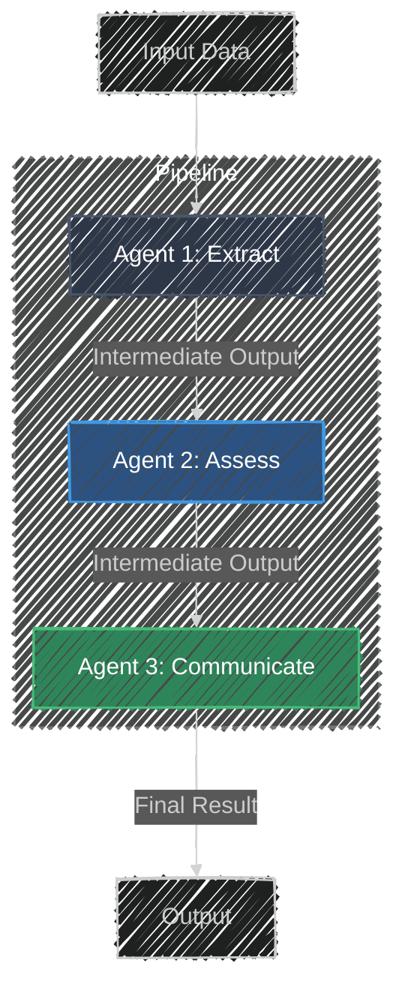

# Sequential Agent Pattern

> **"Step by step."**
> *Break complex tasks into a linear pipeline of specialized agents.*

## Overview

The **Sequential Agent** architecture (also known as a Chain) breaks a complex problem into a series of smaller, more manageable steps. Each step is handled by a specialized agent that is optimized for that specific task. The output of one agent becomes the input for the next, creating a predictable and easier-to-debug pipeline.

## Architecture

## Components

| Component | Description |
|-----------|-------------|
| **Sequential Agent** | The orchestrator that manages the flow of execution, passing outputs from one step to the next. |
| **Sub-Agents** | Specialized agents, each with a narrow instruction and specific role (e.g., Parsing, Evaluation, Generation). |

## How it Works

1. **Decomposition**: The complex task is divided into a logical sequence of sub-tasks.
2. **Execution**: The Sequential Agent runs the first sub-agent with the initial input.
3. **Chaining**: The output of the first agent is captured and passed as context/input to the second agent. This continues until the chain is complete.
4. **Result**: The final agent's output is returned as the result of the entire pipeline.

## When to Use

Use this pattern when a task is too complex for a single prompt or requires multiple distinct steps (e.g., "Research, then Plan, then Write"). It is ideal for workflows where the output of one step is strictly required for the next.

## Demo: Incident Triage Pipeline

This specific implementation demonstrates the pattern with an Incident Triage scenario:

1. **Input**: Raw server logs.
2. **Agent 1 (Extractor)**: Normalizes logs into JSON.
3. **Agent 2 (Assessor)**: Determines severity (P1-P3).
4. **Agent 3 (Communicator)**: Drafts an email.

## Try the Code

1. **Run the Pattern**: `adk web patterns`
2. **Select Pattern**: Click **Sequential Agent**.
3. **Experiment**:
    - Paste a raw log message in the input box.
    - Click the "Quick Scenario" buttons to see how different inputs trigger different severity levels.
    - Click **Run Triage Pipeline** and watch the stepper visualize the progress.

## Resources

- [ADK Documentation: Sequential Agents](https://google.github.io/adk-docs/agents/workflow-agents/sequential-agents/)
- [Google Cloud: Sequential Agent Pattern](https://docs.cloud.google.com/architecture/choose-design-pattern-agentic-ai-system#sequential-pattern)
