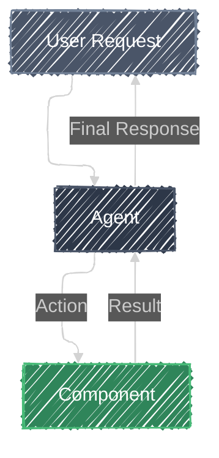

# [Pattern Name]

> **"[Quote about the pattern]"**
> *[Brief tagline]*

## Overview

[Provide a brief description of the pattern. What problem does it solve? What are its key characteristics?]

## Architecture

## Components

| Component | Description |
|-----------|-------------|
| **Agent** | [Description of the agent's role] |
| **[Component]** | [Description of the component] |

## How it Works

[Explain the mechanics of the pattern. How do the components interact?]

## Try the Demo

1. **Enter a Message**: Type *"Hello, World!"*
2. **Response**: The agent (a basic assistant) will reply to your greeting.

## When to Use

Use this pattern when your agent needs to:

- [Scenario 1]
- [Scenario 2]

## Resources

- [Resource 1](https://example.com)
- [Resource 2](https://example.com)
