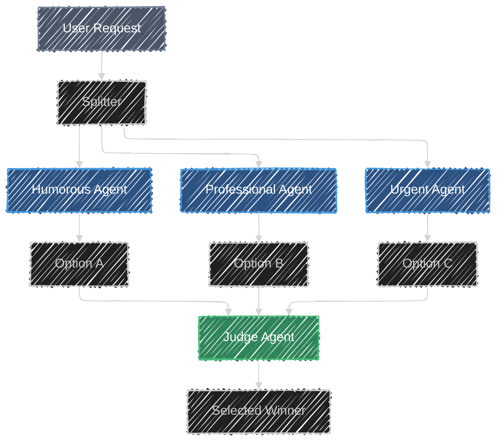

# Voting

> **"Quality emerges when variety meets discernment."**
> *Generate multiple perspectives in parallel and select the best outcome.*

## Overview

The **Voting / Best-of-N** pattern utilizes multiple agents (or the same agent with high temperature/diversity settings) to generate distinct attempts at the same prompt in parallel. A separate "Judge" or "Merger" agent then evaluates these options against a rubric to select the single best response.

This pattern is highly effective for creative tasks, brainstorming, or complex reasoning where a single inference path might get stuck in a local optimum.

## Architecture



## Components

| Component | Description |
|-----------|-------------|
| **Parallel Agents** | A set of agents that receive the input. They can be identical (with high temperature) or configured with different personas/instructions to force diversity. |
| **Merger/Judge** | An agent responsible for reviewing all generated options and selecting the best one based on quality, accuracy, or specific criteria. |

## Demo Use Case: "The Marketing Copy Generator"

In this implementation, we simulate a marketing team:

- **Agent 1 (Humorous)**: Writes funny, witty copy.
- **Agent 2 (Professional)**: Writes trustworthy, corporate copy.
- **Agent 3 (Urgent)**: Writes high-pressure, FOMO-inducing copy.
- **Judge**: The Senior Editor who picks the best angle for the product.

## When to Use

Use this pattern when quality is paramount and you want to maximize the chance of a high-quality output by generating multiple candidates. It is particularly useful when subjectivity exists, as the "best" answer isn't strictly factual but depends on style or creativity. This approach also helps in reducing variance, as generating N options and picking one reduces the risk of a bad outlier compared to noisy individual LLM calls.

## Try the Code

1. **Prerequisites**: Follow the [setup instructions](../../README.md#setup) in the root of the project.
2. **Run the Agent**:
    Run the following command in the root of the project:

    ```bash
    adk web patterns
    ```

3. **Select Pattern**: Click on **Voting** in the sidebar to start the demo.

## Resources

- [Google Cloud Architecture: Parallel Pattern](https://docs.cloud.google.com/architecture/choose-design-pattern-agentic-ai-system#parallel-pattern)
